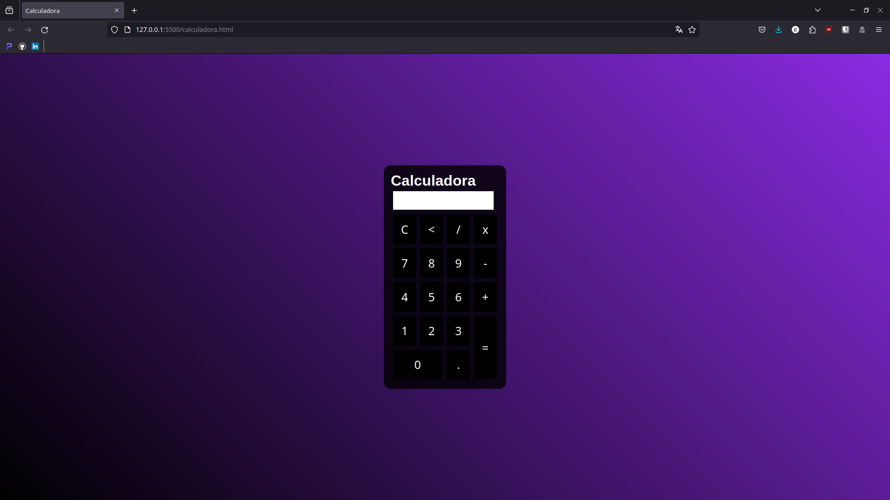

# Calculadora Simples

Esta é uma calculadora simples desenvolvida usando HTML, CSS e JavaScript. 

## Funcionalidades

- Adição, subtração, multiplicação e divisão básicas.
- Suporte para números positivos e negativos.
- Botão de limpar para reiniciar o cálculo.

## Como Usar

1. Abra o arquivo `calculadora.html` em um navegador da web.
2. Insira os números desejados usando os botões numéricos.
3. Use os botões de operação para realizar cálculos.
4. Pressione o botão "C" para limpar a entrada e reiniciar o cálculo.

## Screenshots

# calculadora-simples-html-css-js
# Calculadora Simples  Uma calculadora simples desenvolvida usando HTML, CSS e JavaScript para realizar operações básicas de matemática.
